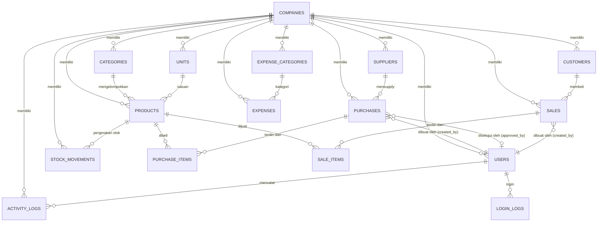
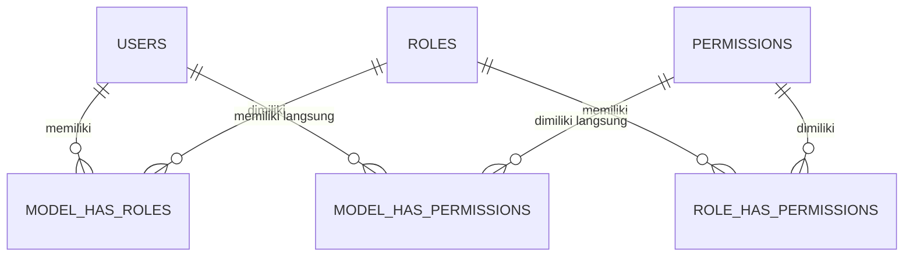

# PHASE 8: ERD DESIGN — Hideo ERP

---

## 8.1 Entity Relationship Diagram

Berikut adalah representasi Entity Relationship Diagram (ERD) Hideo ERP menggunakan format Mermaid.

### 8.1.1 Core Business ERD



### 8.1.2 RBAC ERD (Spatie)



---

## 8.2 Detailed Entity Relationships

### 8.2.1 Module: Authentication & Company

```
┌─────────────────────────────────────────────────────────────────────┐
│                        AUTH & COMPANY                               │
│                                                                     │
│  companies                                                          │
│    │ 1                                                              │
│    ├───< N  users             (one company has many users)          │
│    ├───< N  settings          (one company has many settings)       │
│    │                                                               │
│  users                                                              │
│    │ 1                                                              │
│    ├───< N  activity_logs    (one user has many activity logs)      │
│    ├───< N  login_logs       (one user has many login attempts)     │
│    ├───< N  notifications    (polymorphic: notifiable)              │
│    ├───< N  purchases_created (one user created many POs)           │
│    └───< N  sales_created    (one user created many SOs)            │
│                                                                     │
│  Cardinality Notes:                                                 │
│  - User MUST belong to one Company (company_id NOT NULL)            │
│  - Company can exist without Users (seed support)                   │
│  - User can have zero activity logs (fresh account)                 │
└─────────────────────────────────────────────────────────────────────┘
```

### 8.2.2 Module: Product Management

```
┌─────────────────────────────────────────────────────────────────────┐
│                      PRODUCT MANAGEMENT                            │
│                                                                     │
│  categories                                                         │
│    │ 1                                                              │
│    └───< N  products          (one category has many products)      │
│                               (category_id is NULLABLE)             │
│                                                                     │
│  units                                                              │
│    │ 1                                                              │
│    └───< N  products          (one unit has many products)          │
│                               (unit_id is NOT NULL)                 │
│                                                                     │
│  suppliers                                                          │
│    │ 1                                                              │
│    └───< N  purchases         (one supplier has many POs)           │
│                                                                     │
│  customers                                                          │
│    │ 1                                                              │
│    └───< N  sales             (one customer has many SOs)           │
│                               (customer_id is NULLABLE → walk-in)   │
│                                                                     │
│  Cardinality Notes:                                                 │
│  - Category is optional (NULLABLE) → product without category       │
│  - Unit is mandatory (NOT NULL) → every product must have unit      │
│  - Customer is optional on Sales → walk-in customer allowed         │
└─────────────────────────────────────────────────────────────────────┘
```

### 8.2.3 Module: Purchase Management

```
┌─────────────────────────────────────────────────────────────────────┐
│                     PURCHASE MANAGEMENT                             │
│                                                                     │
│  purchases                     purchase_items                       │
│  ┌─────────────────┐          ┌──────────────────────┐             │
│  │ id (PK)         │──1     N──│ purchase_id (FK)     │             │
│  │ company_id (FK) │          │ product_id (FK)      │──*──1── products │
│  │ supplier_id (FK)│          │ quantity             │             │
│  │ purchase_number │          │ unit_price           │             │
│  │ status          │          │ subtotal             │             │
│  │ total           │          └──────────────────────┘             │
│  │ created_by (FK) │                                              │
│  │ approved_by (FK)│                                              │
│  └─────────────────┘                                              │
│                                                                     │
│  Relationships:                                                      │
│  - Purchase → Purchase Items: ONE-to-MANY (CASCADE delete)          │
│  - Purchase Item → Product: MANY-to-ONE                             │
│  - Purchase → Supplier: MANY-to-ONE (supplier_id NOT NULL)          │
│  - Purchase → User (created_by): MANY-to-ONE (NOT NULL)             │
│  - Purchase → User (approved_by): MANY-to-ONE (NULLABLE)            │
│                                                                     │
│  Status Flow: pending → approved → received → [completed]           │
│                     └→ cancelled (from any active status)           │
└─────────────────────────────────────────────────────────────────────┘
```

### 8.2.4 Module: Sales Management

```
┌─────────────────────────────────────────────────────────────────────┐
│                       SALES MANAGEMENT                              │
│                                                                     │
│  sales                          sale_items                          │
│  ┌──────────────────┐          ┌──────────────────────┐            │
│  │ id (PK)          │──1     N──│ sale_id (FK)         │            │
│  │ company_id (FK)  │          │ product_id (FK)      │──*──1── products │
│  │ customer_id (FK) │          │ quantity             │            │
│  │ sale_number      │          │ unit_price           │            │
│  │ invoice_number   │          │ subtotal             │            │
│  │ status           │          └──────────────────────┘            │
│  │ payment_status   │                                              │
│  │ amount_paid      │                                              │
│  │ total            │                                              │
│  │ created_by (FK)  │                                              │
│  └──────────────────┘                                              │
│                                                                     │
│  Relationships:                                                      │
│  - Sale → Sale Items: ONE-to-MANY (CASCADE delete)                  │
│  - Sale Item → Product: MANY-to-ONE                                 │
│  - Sale → Customer: MANY-to-ONE (NULLABLE → walk-in)               │
│  - Sale → User (created_by): MANY-to-ONE (NOT NULL)                 │
│                                                                     │
│  Status Flow: pending → completed → [done]                          │
│                     └→ cancelled                                    │
│  Payment Flow: unpaid → partial → paid                              │
└─────────────────────────────────────────────────────────────────────┘
```

### 8.2.5 Module: Inventory Management

```
┌─────────────────────────────────────────────────────────────────────┐
│                     INVENTORY MANAGEMENT                            │
│                                                                     │
│  products                     stock_movements                       │
│  ┌─────────────────┐          ┌──────────────────────────┐         │
│  │ id (PK)         │──1     N──│ product_id (FK)          │         │
│  │ stock           │          │ type (in/out/adjustment) │         │
│  │ stock_minimum   │          │ quantity (+/-)           │         │
│  └─────────────────┘          │ stock_before             │         │
│                               │ stock_after              │         │
│                               │ reference_type           │         │
│                               │ reference_id             │         │
│                               │ reason                   │         │
│                               │ created_by (FK)          │         │
│                               └──────────────────────────┘         │
│                                                                     │
│  Relationships:                                                      │
│  - Product → Stock Movements: ONE-to-MANY                           │
│  - Stock Movement → Product: MANY-to-ONE (NOT NULL)                 │
│  - Stock Movement → User: MANY-to-ONE (NOT NULL)                    │
│                                                                     │
│  Reference Types: 'purchase', 'sale', 'adjustment'                  │
│  reference_id points to purchases.id, sales.id, or NULL             │
│                                                                     │
│  Stock Flow:                                                        │
│  - Stock In (purchase or direct): stock += quantity                 │
│  - Stock Out (sale or direct): stock -= quantity                    │
│  - Adjustment: stock += quantity (positive/negative)                │
│                                                                     │
│  Notes:                                                              │
│  - product.stock is denormalized for read performance               │
│  - stock_movements is the source of truth for audit                 │
└─────────────────────────────────────────────────────────────────────┘
```

### 8.2.6 Module: Expense Management

```
┌─────────────────────────────────────────────────────────────────────┐
│                      EXPENSE MANAGEMENT                             │
│                                                                     │
│  expense_categories             expenses                            │
│  ┌─────────────────────┐       ┌────────────────────────┐          │
│  │ id (PK)             │──1  N──│ expense_category_id(FK)│          │
│  │ company_id (FK)     │       │ company_id (FK)        │          │
│  │ name                │       │ description            │          │
│  │ slug                │       │ amount                 │          │
│  └─────────────────────┘       │ expense_date           │          │
│                                │ receipt                │          │
│                                │ created_by (FK)        │          │
│                                └────────────────────────┘          │
│                                                                     │
│  Cardinality Notes:                                                 │
│  - Expense Category → Expense: ONE-to-MANY                          │
│  - Expense MUST have a category (expense_category_id NOT NULL)     │
│  - One category can have zero or many expenses                     │
└─────────────────────────────────────────────────────────────────────┘
```

### 8.2.7 Module: Activity Logs

```
┌─────────────────────────────────────────────────────────────────────┐
│                       ACTIVITY LOGS                                 │
│                                                                     │
│  users                                                              │
│    │ 1                                                              │
│    ├───< N  activity_logs      (one user has many activities)       │
│    ├───< N  login_logs         (one user has many login attempts)   │
│                                                                     │
│  activity_logs                                                      │
│    - Tidak memiliki child table (leaf node)                         │
│    - Polymorphic reference via module + action                      │
│    - old_values / new_values menyimpan JSON diff                    │
│                                                                     │
│  login_logs                                                         │
│    - Mencatat semua attempt (success & failed)                      │
│    - user_id NULLABLE → bisa gagal karena email tidak ditemukan     │
│    - email tetap dicatat untuk analisis failed attempts             │
└─────────────────────────────────────────────────────────────────────┘
```

---

## 8.3 Alasan Desain Database

### 8.3.1 Normalization (3NF)

Database dirancang mengikuti **Third Normal Form (3NF)**:

| Level | Status | Keterangan |
|---|---|---|
| 1NF | ✅ | Atomic values, no repeating groups |
| 2NF | ✅ | Full functional dependency on PK |
| 3NF | ✅ | No transitive dependency |

### 8.3.2 Denormalization yang Disengaja

**1. `products.stock` — Denormalized stock counter**
- **Alasan:** Query stok adalah operasi paling frekuen di ERP. Join dengan `stock_movements` untuk setiap read akan sangat lambat.
- **Mitigasi:** `stock_movements` tetap menjadi **source of truth** untuk audit. `products.stock` diupdate dalam **database transaction** bersamaan dengan insert `stock_movements`.
- **Sinkronisasi:** Jika ada selisih, bisa di-rekonsiliasi dengan `SELECT SUM(quantity) FROM stock_movements`.

**2. `purchase_items.subtotal` & `purchases.total`**
- **Alasan:** Menghindari perhitungan ulang setiap kali read.
- **Mitigasi:** Dihitung saat transaksi dibuat dan dire-kalkulasi saat ada perubahan items.

**3. `sale_items.subtotal` & `sales.total`**
- **Alasan:** Sama seperti purchase.

### 8.3.3 Soft Delete Strategy

- **Master data** (products, categories, suppliers, customers, users): Soft delete (`deleted_at`).
- **Transactional data** (purchases, sales, expenses): Soft delete untuk audit trail.
- **Junction data** (purchase_items, sale_items): Hard delete (CASCADE) saat parent dihapus.
- **Logs** (activity_logs, login_logs, stock_movements): **No delete** — immutable audit trail.
- **Alasan:** Data transaksional yang sudah diproses tidak boleh hilang. Soft delete memungkinkan restorasi.

### 8.3.4 Index Strategy

| Query Pattern | Index | Type |
|---|---|---|
| "Cari produk by nama" | `idx_products_name` | BTREE |
| "Cek stok menipis" | `idx_products_stock_minimum` | BTREE |
| "Filter PO by status" | `idx_purchases_company_status` | COMPOSITE BTREE |
| "Laporan penjualan per periode" | `idx_sales_order_date` | BTREE |
| "Stock history per produk" | `idx_stock_movements_product_id` | BTREE |
| "Activity log per user" | `idx_activity_logs_user_id` | BTREE |
| "Unique SKU per company" | `uq_products_company_sku` | UNIQUE BTREE |

### 8.3.5 Cascade Rules

| FK Column | On Delete | On Update | Alasan |
|---|---|---|---|
| `purchase_items.purchase_id` | CASCADE | CASCADE | Items tidak berarti tanpa PO |
| `sale_items.sale_id` | CASCADE | CASCADE | Items tidak berarti tanpa SO |
| `stock_movements.product_id` | RESTRICT | CASCADE | Mencegah loss of audit trail |
| `purchases.supplier_id` | RESTRICT | CASCADE | Cegah hapus supplier bertransaksi |
| `products.category_id` | SET NULL | CASCADE | Kategori bisa dihapus, produk tetap ada |

### 8.3.6 Data Integrity

| Mekanisme | Contoh |
|---|---|
| **UNIQUE Constraints** | SKU per company, slug per company, purchase_number per company |
| **CHECK Constraints** | selling_price >= purchase_price, quantity > 0 |
| **FOREIGN KEY Constraints** | Semua relasi bisnis menggunakan FK |
| **DEFAULT Values** | status = 'pending', payment_status = 'unpaid', stock = 0 |
| **NOT NULL** | Field kritis: name, email, amount, total, dll |

### 8.3.7 Scalability Considerations

1. **Company Isolation:** Semua query bisnis menggunakan `company_id` + global scope — memudahkan sharding di masa depan.
2. **Composite Indexes:** Untuk query filter multi-kolom (misal `company_id + status`).
3. **Date Partitioning:** Untuk `stock_movements` dan `activity_logs` — siap untuk partitioned tables.
4. **JSON Columns:** `activity_logs.old_values` dan `new_values` menggunakan JSON — fleksibel tanpa schema change.

---

--- _End of Phase 8 — ERD Design_ ---
